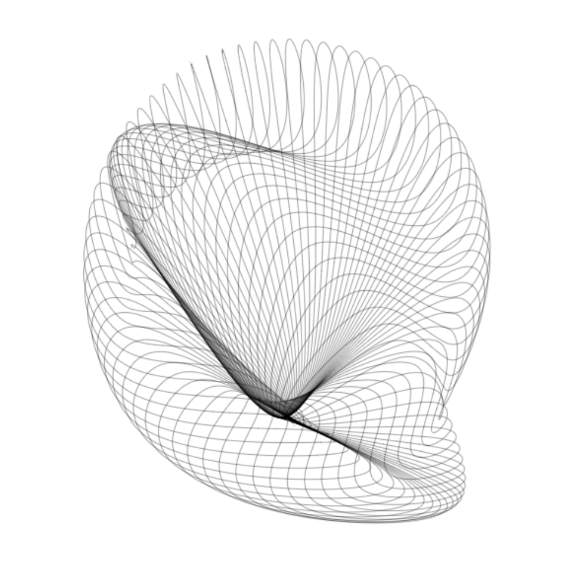

# Introduction

This is the summary of my course study of Computational Form at Parsons' Data Visualization MS porgram in Spring 2022. This course is a life changer for me and as a two-time graduate student, I think I've earned the experience to say this is the best class I have ever taken in my life. This course is taught by Justin Bakse. He also created a "textbook" [Comp Form](https://compform.net/) to accompany the teaching.

I learned the following creative coding concepts and techniques:

- Random Value
- Noise, Perlin Noise, Noise Loop
- Parameterized Design, Tweakpine
- Pixel Data in Canvas
- Drawing Using Periodic Functions (The Magical Sin & Cos)
- Vector Drawing with Paper.js
- Turtle Graphics and Recursive Trees
- Generating Text Using RiTa, Markov, and Tracery
- Basic Data Sonification
- Physics Engine with Matter.js
- WebGL
- Bezier Curves
- Particle Systems (An Extension of p5.Vector or Physics Engine)

I fell in love with creative coding because of this course. I hope to continue this journey.

### Some of My Favorite Sketches

1. Splatter drawn using vector particle system
   

2. Mondrian in Space, again using vector particle system
   

3. Antelope Abyss, using nested Perlin Noise Loops
   

4. Pixel Map, love the gradient color palette
   

5. Flower vector drawing in Paper.js
   
6. Untitled, using periodic functions to draw abstract shapes in Paper.js
   

7. Vector garden, using periodic functions to draw flowers in Paper.js
   
